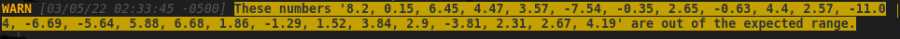
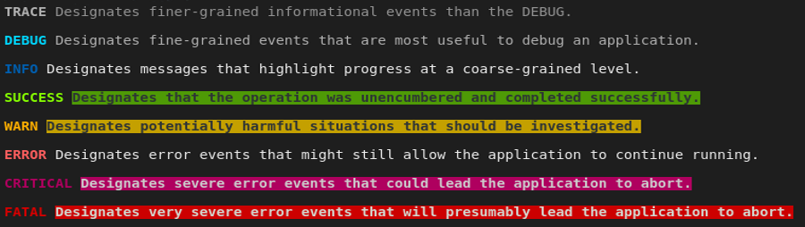
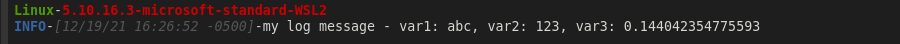
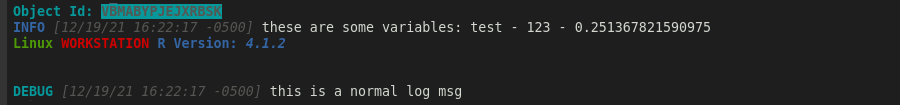

---
output:
  github_document:
    pandoc_args: --webtex=https://ibm.codecogs.com/png.latex?
always_allow_html: yes
---

<!-- README.md is generated from README.Rmd. Please edit that file -->

```{r, include = FALSE}
knitr::opts_chunk$set(
  collapse = TRUE,
  comment = "#>",
  fig.path = "man/figures/README-",
  out.width = "100%"
)
```

```{css, echo=FALSE}
.console-out {
  background-color: black;
  border: 3px solid white;
}
```

# dyn.log

# Overview 

<!-- badges: start -->
[](https://github.com/bmoretz/dyn.log/actions)
[](https://cran.r-project.org/web/licenses/MIT)
[](https://app.codecov.io/gh/bmoretz/dyn.log?branch=master)
[](https://bmoretz.github.io/dyn.log/)
[](https://lifecycle.r-lib.org/articles/stages.html#stable)
<!-- badges: end -->

The goal of dyn.log is to be a comprehensive and dynamic configuration driven logging package
for R. While there are several excellent logging solutions already in the R ecosystem, I always
feel constrained in some way by each of them. Every project is designed differently to achieve its stated goal;
to solve some problem, and ultimately the utility of a logging solution is its ability to adapt
to the project’s design. This is the rai·&#x200B;son d'être for dyn.log; to provide a modular design, 
template mechanics and a configuration-based integration model. This enableds the logger to integrate 
deeply into your design, even though it knows nothing about it.

## Installation

#### GitHub

You can install the development version of dyn.log from [GitHub](https://github.com/) with:

```r
remotes::install_github("bmoretz/dyn.log")
```

#### CRAN

You can install the latest stable version of dyn.log from CRAN:

(coming soon)

### Overview

```{r, echo=T}
library(dyn.log)
```

### Basic Usage

For basic/most common usage simply install the package from one of the above sources, load the package, initialize the logger, and a logging instance will show up in your global environment (by default, named 'Logger'):

```{r, eval=F}
library(dyn.log)

init_logger()

var1 <- "abc"; var2 <- 123; var3 <- runif(1)

Logger$debug("my log message - var1: {var1}, var2: {var2}, var3: {var3}")
```


You can also skip the call to *init_logger* by setting a global option that specifies the configuration you wish to use, i.e., placing:

```{r}
options("dyn.log.config" = "default")
```

In your .Rprofile will automatically configure the default logger and the global logging instance will be attached when you call:

```{r}
library(dyn.log)
```

The **"dyn.log.config"** variable can be either a predefined configuration (name) in the package, or a path to a local file that you have pre-customized. This is useful for sharing a single bespoke log configuration across multiple packages or projects.

### Logging

There are three main components of a log message, each of them are covered in detail in their respective vignettes. For more detail about how logging works and how you can customize it, please see the [package site](https://bmoretz.github.io/dyn.log/):

* Levels
  + The levels you want to have accessible in your logger.
* Formats
  + The types that define contextual information to be logged in a message.
* Layouts
  + Containers for format objects that define the rendering specifications for a log message.
  
The logging functionality is exposed by a R6 class, *LogDispatch*, is accessible as a global variable called, by default, **Logger**. The Logger will have methods that correspond to the *log levels* that are defined in its yaml configuration, which makes logging intuitive. Log messages are automatically assumed to be in standard [glue](https://github.com/tidyverse/glue) format so local environment variables are captured in messages.

#### Simple Example

The "out of the box" (OTB) configuration specifies a default vanilla log format that displays the
level that was logged, the current time-stamp (with the default TS format), and the log message:

```{r simple_example, eval=F}
var1 <- "abc"; var2 <- 123; var3 <- runif(1)

Logger$debug("my log message - var1: {var1}, var2: {var2}, var3: {var3}")
```


#### Configuration

Everything about dyn.log is configuration driven, the package comes with a basic configuration **default.yaml**, show below it its entirety and broken down in the sections that follow:

*For a detailed look at customizing these settings please see [Configurations](https://bmoretz.github.io/dyn.log/articles/Configuration.html) vignette online.*

```yaml
`r xfun::file_string('inst/default.yaml')`
```

### Logger Variable

The first setting, *variable*, defines the name of the global variable you want to access the logger with. The default is **Logger**, but you can easily change it to: *log*, *my_log*, *msg* or any other value (as long as it's a *valid* R variable name). The **LogDispatch** object is also a [singleton](https://en.wikipedia.org/wiki/Singleton), so you always access the logger directly:

```{r, eval=F}

nums <- paste0(round(rnorm(25, 0, 5), digits = 2), collapse = ", ")

LogDispatch$new()$warn("These numbers '{nums}' are out of the expected range.")
```


#### Settings

The **settings** node contains the core settings of the log dispatcher, by attribute. These
are covered in detail in the [Configuration](https://bmoretz.github.io/dyn.log/articles/Configuration.html) section of the manual.

#### Levels

The **levels** node contains the log levels you want available in your environment. When a log
level is defined in the configuration, it automatically becomes accessible via a first-class 
function on the dispatcher, e.g.:

```{r, eval = F}
Logger$info("This will be logged with 'INFO' severity level")
```

You can view all configured log levels, and get a quick summary about them by calling *display_log_levels():*

```{r, eval = F}
display_log_levels()
```



The default logging configuration closely resembles the fairly ubiquitous [log4j](https://logging.apache.org/log4j/1.2/apidocs/org/apache/log4j/Level.html) scheme. For a detailed look at log levels refer to the [Levels](https://bmoretz.github.io/dyn.log/articles/Levels.html) vignette online.

#### Layouts

Every log message needs to have a format so the dispatcher knows what to render on a log call. Formats are defined in the yaml config and comes with some basic ones pre-configured.

The default log layout is a standard format: {LEVEL} - {TIMESTAMP} - {MSG}, with space as a separator between format objects.

### Customizing a Log Message

Log message layouts are exposed as an S3 type in the package called *log_layout*. Layouts are
composed from a series of objects that inherit from *fmt_layout*.

```{r, customized_layout, eval=F}

new_log_layout(
  format = list(
    new_fmt_metric(crayon::green$bold, "sysname"),
    new_fmt_metric(crayon::red$bold, "release"),
    new_fmt_line_break(),
    new_fmt_log_level(),
    new_fmt_timestamp(crayon::silver$italic),
    new_fmt_log_msg()
  ),
  seperator = '-',
  association = "custom"
)

Logger$info("my log message - var1: {var1}, var2: {var2}, var3: {var3}", layout = "custom")

```



For a detailed look at layouts refer to the [Layouts](https://bmoretz.github.io/dyn.log/articles/Layouts.html) vignette online.

### Logging Associations

One thing you may have noticed about the previous log layout definition was the *association* parameter. Associations are a useful way to build a customized log layout for your custom R6 types. This can be especially useful in larger applications, such as [plumber](https://github.com/rstudio/plumber/) services or [shiny](https://github.com/rstudio/shiny) dashboards.

A TestObject is defined as below, who's primary responsibly is to assign a randomly generated identifier to
the instance via the constructor. There is also a method on the object that will call the logger with some
local scope variables that will be logged as well.

```{r, test_obj_def, eval=F}
TestObject <- R6::R6Class(
  classname = "TestObject",

  public = list(
    id = NULL,

    initialize = function() {
      self$id <- private$generate_id()
    },

    test_method = function() {
      a <- "test"; b <- 123; c <- runif(1)

      Logger$info("these are some variables: {a} - {b} - {c}")
    }
  ),

  private = list(
    generate_id = function(n = 15) {
      paste0(sample(LETTERS, n, TRUE), collapse =  '')
    }
  )
)

obj <- TestObject$new()
```

With the above class defined, we can create a custom log layout that associated with this R6 type with
a new log layout:

```{r, cls_assocation, eval=F}
new_log_layout(
  format = list(
    new_fmt_literal(crayon::cyan$bold, "Object Id:"),
    new_fmt_cls_field(crayon::bgCyan$silver$bold, "id"),
    new_fmt_line_break(),
    new_fmt_log_level(),
    new_fmt_timestamp(crayon::silver$italic),
    new_fmt_log_msg(),
    new_fmt_line_break(),
    new_fmt_metric(crayon::green$bold, "sysname"),
    new_fmt_metric(crayon::red$bold, "nodename"),
    new_fmt_literal(crayon::blue$bold, "R Version:"),
    new_fmt_metric(crayon::blue$italic$bold, "r_ver"),
    new_fmt_line_break()
  ),
  association = "TestObject"
)

# notice above, "Logger$info" is called inside the context of the Test Object,
# and the variables are scoped to inside the function.
obj$test_method()
  
Logger$debug("this is a normal log msg")
```



As you can see, only when the logger is invoked from inside the class that has a custom layout associated with it does the custom layout get used. The follow-up log call (outside the class scope) reverts back to the standard layout settings.

*For a detailed look at customizing a layout for a specific type, please see [Configurations](https://bmoretz.github.io/dyn.log/articles/Configuration.html) vignette online for an example.*

## Acknowledgments

  * R Core for developing and maintaining such an amazing language.
  * R Studio for building an incredible open-source ecosystem.
  * [Hadley Wickham](https://github.com/hadley) for being super-human.
  * [Jim Hester](https://github.com/jimhester) for all the fantastic r-lib/actions (covr, lintr & build, pkgdown, etc).
  * [Brody Gaslam](https://github.com/brodieG/fansi) for developing the [fansi](https://github.com/brodieG/fansi) package which is responsible for all the the pretty logger output in the documentation.
  * Everyone in the [#rstats](https://twitter.com/search?q=%23rstats) community for being inclusive, welcoming and incredibly knowledgeable.
