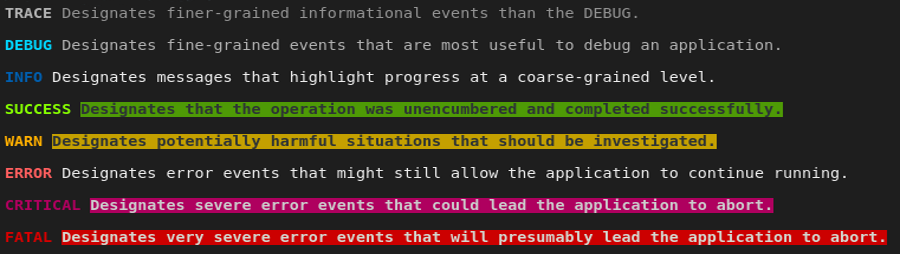
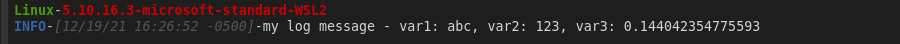

<!-- README.md is generated from README.Rmd. Please edit that file -->

# dyn.log

<!-- badges: start -->

[](https://github.com/bmoretz/dyn.log/actions)
<!-- badges: end -->

The goal of dyn.log is to be a comprehensive and dynamic configuration
driven logging package for R. While there are several excellent logging
solutions already in the R ecosystem, I always feel constrained in some
way by each of them. Every project is designed differently to achieve
its stated goal; to solve some problem, and ultimately the utility of a
logging solution is its ability to adapt to the project’s design. This
is the rai·son d’ê·tre for dyn.log, to provide a modular design,
template mechanics and a configuration-based integration model, so that
the logger can integrate deeply into your design, even though it knows
nothing about it.

## Installation

#### GitHub

You can install the development version of dyn.log from
[GitHub](https://github.com/) with:

``` r
remotes::install_github("bmoretz/dyn.log")
```

#### CRAN

You can install the latest stable version of dyn.log from CRAN:

(coming soon)

## Overview

Since everything about dyn.log is configuration driven, the package
comes with a basic configuration **default.yaml**:

``` yaml
settings:
  threshold: TRACE
  max_callstack: 5
levels:
- name: TRACE
  severity: !expr 600L
  log_style: !expr crayon::make_style("antiquewhite3")$bold
  msg_style: !expr crayon::make_style('gray60')
- name: DEBUG
  severity: !expr 500L
  log_style: !expr crayon::make_style('deepskyblue2')$bold
  msg_style: !expr crayon::make_style('gray90')
- name: INFO
  severity: !expr 400L
  log_style: !expr crayon::make_style('dodgerblue4')$bold
  msg_style: !expr crayon::make_style('gray100')
- name: SUCCESS
  severity: !expr 300L
  log_style: !expr crayon::make_style('chartreuse')$bold
  msg_style: !expr crayon::bgGreen$bold$black
- name: WARN
  severity: !expr 350L
  log_style: !expr crayon::make_style('darkorange')$bold
  msg_style: !expr crayon::bgYellow$bold$black
- name: ERROR
  severity: !expr 200L
  log_style: !expr crayon::make_style('firebrick1')$bold
  msg_style: !expr crayon::bgBlack$bold$white
- name: FATAL
  severity: !expr 100L
  log_style: !expr crayon::make_style('firebrick')$bold
  msg_style: !expr crayon::bgRed$bold$white
```

The *settings* node contains the core settings of the log dispatcher, by
attribute.

The *levels* node contains the log levels you want to have in your
environment. You’ll notice that **log_style** and **msg_style** are
[crayon](https://github.com/r-lib/crayon) styles. This is because each
level has a unique render format that helps to visually assist parsing
of log information.

The logging functionality is exposed by a R6 class, *LogDispatch*, that
is available as a package namespace variable called **Logger**. The
**Logger** will have methods that correspond to the *log levels* that
are defined in its yaml configuration, which makes logging intuitive.
When the package is loaded, the logger will appear in the top / global
environment as *Logger*.

Log messages are automatically assumed to be in standard
[glue](https://github.com/tidyverse/glue) format so local environment
variables are capturable in the log output.

## Simple Example

The following example wraps the logger call in *capture.output* and
*message* so that the [crayon](https://github.com/r-lib/crayon) styles
are shown correctly in markdown.

``` r
library(dyn.log)

var1 <- "abc"; var2 <- 123; var3 <- runif(1)

Logger$debug("my log message - var1: {var1}, var2: {var2}, var3: {var3}")
```


### Standard Log Levels & Styles

The default configuration (above) defines the following “standard” log
levels, and their output can be seen in the below screenshot:



### Customizing a Log Message

Log message layouts are exposed as an S3 type in the package called
*log_layout*. Layouts are composed from a series of objects that inherit
from *fmt_layout*.

``` r
new_log_layout(
    new_fmt_metric(crayon::green$bold, "sysname"),
    new_fmt_metric(crayon::red$bold, "release"),
    new_fmt_line_break(),
    new_fmt_log_level(),
    new_fmt_timestamp(crayon::silver$italic),
    new_fmt_log_msg(),
    seperator = '-',
    association = "default"
  )

Logger$info("my log message - var1: {var1}, var2: {var2}, var3: {var3}")
```



For a detailed look at these objects, and how they work please see the
“Log Layouts” *vignette*.

> (vignette(“Log Layouts”, package = “dyn.log”)

### Logging Associations

One thing you may have noticed about the previous log layout definition
was the *association* parameter. Associations are a useful way to build
a customized log layout for your custom R6 types. This can be especially
useful in larger applications, such as
[plumber](https://github.com/rstudio/plumber/) services or
[shiny](https://github.com/rstudio/shiny) dashboards.

A TestObject is defined as below, who’s primary responsibly is to assign
a randomly generated identifier to the instance via the constructor.
There is also a method on the object that will call the logger with some
local scope variables that should be logged as well.

``` r
TestObject <- R6::R6Class(
  classname = "TestObject",

  public = list(
    id = NULL,

    initialize = function() {
      self$id <- private$generate_id()
    },

    test_trace = function() {
      a <- "test"; b <- 123; c <- runif(1)

      Logger$info("these are some variables: {a} - {b} - {c}")
    }
  ),

  private = list(
    generate_id = function(n = 15) {
      paste0(sample(LETTERS, n, TRUE), collapse =  '')
    }
  )
)
```

With the above class defined, we can create a custom log layout that
associated with this R6 type with a new log layout:

``` r
  new_log_layout(
    new_fmt_literal(crayon::cyan$bold, "Object Id:"),
    new_fmt_cls_field(crayon::bgCyan$silver$bold, "id"),
    new_fmt_line_break(),
    new_fmt_log_level(),
    new_fmt_timestamp(crayon::silver$italic),
    new_fmt_log_msg(),
    new_fmt_line_break(),
    new_fmt_metric(crayon::green$bold, "sysname"),
    new_fmt_metric(crayon::red$bold, "nodename"),
    new_fmt_literal(crayon::blue$bold, "R Version:"),
    new_fmt_metric(crayon::blue$italic$bold, "r_ver"),
    new_fmt_line_break(),
    association = "TestObject"
  )

  obj$test_trace()
    
  Logger$debug("this is a normal log msg")
```


As you can see, only when the logger is invoked from inside the class
that has a custom layout associated with it does the custom layout get
used. The follow-up log call (outside the class scope) reverts back to
the standard layout settings.

For a detailed look at class associations, and how they work please see
the “Log Layouts” *vignette*.

> (vignette(“Log Layouts”, package = “dyn.log”)
